# 🎯 CVDanger — AI система детекции военных объектов в реальном времени

CVDanger — production-ready микросервисная система видеонаблюдения с автоматической детекцией военной техники и пехоты на основе компьютерного зрения и AI агентов. Система принимает видеопоток с камер наблюдения, в реальном времени детектирует угрозы на каждом кадре, анализирует обстановку с учётом географического контекста и характера местности и автономно принимает тактические решения — с мгновенным уведомлением операторов через Telegram.

Проект реализован как полноценный **end-to-end пайплайн**: от загрузки видео до принятия решения AI агентом — без участия человека на каждом шаге.

---

## 🏗️ Архитектура

Система построена на **event-driven микросервисной архитектуре**. Шесть независимых сервисов взаимодействуют исключительно через **Apache Kafka** — без прямых зависимостей между собой. Это обеспечивает горизонтальное масштабирование каждого компонента независимо, полную отказоустойчивость при частичных сбоях и чёткое разделение ответственности.

```
┌──────────────────────────────────────────────────────────────────────┐
│                            ОПЕРАТОР                                   │
│                   Telegram Bot  /  Streamlit UI                       │
└──────────────────────────┬───────────────────────────────────────────┘
                           │ загрузка видео
                           ▼
         ┌─────────────────────────────────┐
         │       backend_VideoProduce       │
         │  Приём → нарезка → MinIO + БД   │
         └──────────────┬──────────────────┘
                        │ Kafka: ready_to_detect
                        ▼
         ┌─────────────────────────────────┐
         │         DetectGraphApi           │
         │  YOLO детекция → боксы → БД     │
         │       GraphQL API отчёты        │
         └──────────────┬──────────────────┘
                        │ Kafka: alerts_topic
                        ▼
         ┌─────────────────────────────────┐
         │          AlertsService           │
         │  Проверка порогов → конфигурация │
         └──────────────┬──────────────────┘
                        │ Kafka: real_alerts
                        ▼
    ┌───────────────────────────────────────────┐
    │                 AIService                  │
    │  Tool Calling · Structured Output · Report │
    └──────────────┬────────────────────────────┘
                   │ Kafka: agent_actions
                   ▼
         ┌─────────────────────────────────┐
         │           telegram_bot           │
         │  Алерты · Отчёты · Управление   │
         │     Celery авто-доклад 10 мин   │
         └─────────────────────────────────┘
```

---

## ⚡ Полный пайплайн — от видео до решения

### 📹 Шаг 1 — Загрузка и подготовка видео
Оператор загружает видео через Streamlit интерфейс или напрямую через REST API, указывая номер камеры. `backend_VideoProduce` генерирует уникальный UUID для каждого видео, сохраняет оригинал в MinIO бакет `videos` и фиксирует запись в PostgreSQL. Затем через **PyAV** нарезает видео на фреймы с частотой 1 кадр/сек — каждый фрейм загружается в бакет `frames`, записывается в БД со статусом `not_processed` и путь к нему публикуется в Kafka топик `ready_to_detect`. Видео и все его фреймы связаны единым UUID — это позволяет восстановить принадлежность без дополнительных запросов.

Параллельно сервис слушает топик `frame_detected` — по мере обработки фреймов в `DetectGraphApi` статус в БД обновляется на `processed`, обеспечивая полный аудит прохождения каждого кадра через пайплайн.

### 🔍 Шаг 2 — Детекция объектов на каждом фрейме
`DetectGraphApi` параллельно обрабатывает фреймы из очереди `ready_to_detect`. Каждый фрейм скачивается из MinIO, кодируется в base64 и отправляется на инференс в **BentoService** (YOLOE ONNX на порту 7777). При обнаружении объектов — через **PIL** рисует боксы с подписями классов и уровнями уверенности поверх оригинального изображения, загружает аннотированный фрейм в бакет `detected`. Каждый найденный объект фиксируется в PostgreSQL отдельной записью с классом, уверенностью и координатами бокса. Результаты детекции публикуются в `alerts_topic`. В любом случае — независимо от наличия объектов — фрейм попадает в `frame_detected` для обновления статуса.

### 🚨 Шаг 3 — Интеллектуальная фильтрация по порогам
`AlertsService` получает результаты детекции и сверяет с конфигурацией камеры из `rules.json` — единственного источника правды о состоянии всей системы. Для каждого класса объектов — своё пороговое значение, своё на каждую камеру. При превышении порога формирует алерт, обогащая его **географическими координатами** камеры и **текстовым описанием окружающей местности**. Каждый превышенный класс публикуется в `real_alerts` отдельным сообщением — AI агент принимает решения по каждой угрозе независимо.

### 🤖 Шаг 4 — Автономное принятие тактического решения
`AIService` получает алерт из `real_alerts` и запускает **Tool Calling агента** на базе Groq API. LLM анализирует полный контекст: тип угрозы, количество объектов, характер местности вокруг камеры — жилая зона, территория врага, наличие мирных жителей. На основе этого агент автономно выбирает тактический инструмент и исполняет его. Решение с координатами цели публикуется в `agent_actions`.

### 📱 Шаг 5 — Уведомление операторов
`telegram_bot` подписан на оба выходных топика — `real_alerts` и `agent_actions` — и мгновенно доставляет операторам полную картину: что обнаружено, где, в каком количестве и какое решение принял агент. Параллельно каждые **10 минут** Celery beat автоматически собирает данные по всем камерам, отправляет в AIService для аналитической обработки и доставляет развёрнутый тактический доклад оператору.

---

## 🛠️ Технологический стек

| Категория | Технологии |
|-----------|-----------|
| **Runtime** | Python 3.12, asyncio, uv |
| **Web Framework** | FastAPI, Uvicorn |
| **ML / CV** | BentoML, YOLOE, ONNX Runtime, OpenCV, PyAV, PIL |
| **AI Агенты** | Groq API (`openai/gpt-oss-120b`), Tool Calling, Structured Output |
| **Валидация данных** | Pydantic v2 |
| **Messaging** | Apache Kafka (KRaft), FastStream |
| **База данных** | PostgreSQL 15, SQLAlchemy (async), asyncpg |
| **Объектное хранилище** | MinIO (S3-compatible), aiobotocore, aiofiles |
| **Очереди задач** | Celery, Redis |
| **HTTP клиент** | aiohttp |
| **Telegram** | Aiogram 3, FSM |
| **UI** | Streamlit |
| **GraphQL** | Strawberry GraphQL |
| **Логирование** | Loguru |
| **Инфраструктура** | Docker, Docker Compose |

---

## 🌐 Веб-интерфейсы

| Интерфейс | URL | Назначение |
|-----------|-----|-----------|
| 🎬 Streamlit UI | http://localhost:8501 | Загрузка видео с камер |
| 🔍 GraphQL IDE | http://localhost:8001/graphql | Интерактивные запросы к детекциям |
| 🪣 MinIO Console | http://localhost:9001 | Просмотр видео, фреймов, детекций |
| 🐘 pgAdmin | http://localhost:5050 | Управление базой данных |
| 📊 Kafbat UI | http://localhost:8090 | Мониторинг Kafka топиков и сообщений |

---

## 🚀 Запуск

### 1. Переменные окружения

В корне проекта и в каждом микросервисе есть `.env.example`. Скопируй и заполни:

```bash
cp .env.example .env
```

> ⚠️ После заполнения `.env` проверь `config.py` в каждом микросервисе — URL для Kafka, PostgreSQL, MinIO и Redis прописаны явно и должны совпадать с реальным адресом твоей машины и значениями из `.env`.

### 2. Сборка BentoML контейнера

Перед запуском инфраструктуры необходимо собрать контейнер детектора. Подробная инструкция в разделе **BentoService** ниже.

### 3. Запуск инфраструктуры

```bash
docker compose up
```

Поднимает PostgreSQL, Redis, MinIO, Kafka в KRaft режиме, BentoML детектор и все веб-интерфейсы.

### 4. Запуск микросервисов

Каждый микросервис запускается отдельно из своей папки:

```bash
cd backend_VideoProduce  && uv run -m app.main   # порт 8000
cd DetectGraphApi        && uv run -m app.main   # порт 8001
cd AlertsService         && uv run -m app.main   # порт 8002
cd AIService             && uv run -m app.main   # порт 8003
cd telegram_bot          && uv run -m bot.main   # Telegram бот + Celery worker + beat
cd frontend_VideoProduce && uv run -m app.main   # порт 8501
```

---

# 🤖 BentoService — YOLO детектор

Изолированный ML сервис — единственная точка инференса в системе. Все остальные микросервисы не знают ничего про модель, веса или архитектуру детектора: они просто отправляют `POST /detect` с изображением в base64 и получают обратно боксы, классы и уровни уверенности. Такая инкапсуляция позволяет независимо обновлять модель и масштабировать детектор не затрагивая остальную систему.

Внутри работает **YOLOE модель**, дообученная на тщательно размеченном датасете военной техники и пехоты. Модель сконвертирована в **ONNX формат** для максимально стабильного и быстрого инференса в production окружении без зависимости от конкретного ML фреймворка.

Сервис поднимается на порту **7777**.

## 🎯 Детектируемые классы

| ID | Класс |
|----|-------|
| 0 | Пехота |
| 1 | Танк |
| 2 | БМП (Боевая Машина Пехоты) |
| 3 | БТР (Бронетранспортер) |
| 4 | Бронемашина |
| 5 | Артиллерия |
| 6 | РСЗО (Ракетная Система Залпового Огня) |
| 7 | БПЛА (Беспилотный Летательный Аппарат) |

Порог уверенности — `0.4`. Все детекции ниже этого значения отбрасываются автоматически.

## ⚙️ Режимы работы

**Fine-tuned модель (рекомендуемый)** — дообученная на профильном военном датасете с фиксированным маппингом классов по индексу (`FINETUNED_MAP`). Активен по умолчанию.

**Базовая YOLOE модель (zero-shot)** — без дообучения, на основе текстовых описаний классов. Для переключения в `modelservice.py` раскомментировать `self.model.set_classes(self.classes)` и маппинг `CLASSES_MAP`, закомментировать `FINETUNED_MAP`.

## 🔧 Подготовка и запуск

### Шаг 1 — Регистрация модели в BentoML store

Перед первым запуском модель необходимо один раз зарегистрировать. Положи `.onnx` файл в `BentoService/FineTune/KaggleModel/`, укажи его имя в `bentomodel.py` и запусти из корня проекта:

```bash
uv run BentoService/bentomodel.py
```

### Шаг 2 — Локальный запуск

```bash
# Запустить конкретный эндпоинт /detect
uv run bentoml serve BentoService.modelservice:Detector

# Запустить все эндпоинты сервиса
uv run bentoml serve BentoService/modelservice.py
```

### Шаг 3 — Сборка Docker контейнера

> ⚠️ Перед сборкой убедись что в `modelservice.py` аннотация параметра — `bytes`, не `Image`:
> ```python
> def detect(self, image: bytes) -> Dict[str, Any]:
> ```

```bash
# Сборка bento-архива
uv run bentoml build -f bentofile.detect.yaml

# Контейнеризация bento-архива
uv run bentoml containerize war-detector:latest --image-tag war-detector:latest

# Патч OpenCV (обязательно!)
docker build -f dockerfile.fix -t war-detector:fixed .

# Запуск контейнера
docker run -p 7777:7777 war-detector:fixed
```

> 💡 **Почему нужен `dockerfile.fix`?** В `opencv-python==4.13.0.90` баг: при импорте `cv2` в контейнере падает `ImportError: libxcb.so.1` — bundled библиотеки имеют неразрешённые зависимости на системный `libxcb.so.1` которого нет в минимальных Docker образах. `dockerfile.fix` откатывает до стабильной `opencv-python-headless==4.12.0.88`. [GitHub issue](https://github.com/opencv/opencv-python/issues/1183)

## 🏋️ Fine-tune своей модели

### Вариант A — Локально

```bash
# 1. Положи изображения:
BentoService/FineTune/yolo_dataset/images/train/

# 2. Положи CSV разметку:
BentoService/FineTune/yolo_dataset/csv/

# 3. Замени маппинг классов в convert_csv_to_yolo.py (label_to_id)
#    и список классов в dataset.yaml (секция names) на свои

# 4. Конвертируй разметку в YOLO формат
uv run BentoService/FineTune/convert_csv_to_yolo.py

# 5. Запусти обучение
uv run BentoService/FineTune/fine_tune.py
```

> ⚠️ В `fine_tune.py` смени `device="cpu"` на `device="cuda"` если есть GPU.

Лучшие веса появятся в `runs/train/yolo_finetuned/weights/best.pt`. Скопируй в `KaggleModel/`, обнови путь в `bentomodel.py`, запусти регистрацию модели (Шаг 1).

### Вариант B — Kaggle / Google Colab (рекомендуется)

Перенеси код из `FineTune/` на платформу, загрузи датасет и базовые веса, обучи на GPU, скачай `best.pt` в `KaggleModel/`.

### Конвертация .pt → .onnx

```bash
# Укажи путь к .pt модели в convert_to_onnx.py, затем:
uv run BentoService/FineTune/konvert_to_onnx/convert_to_onnx.py
```

---

# 🎬 backend_VideoProduce — Приём и нарезка видео

FastAPI микросервис — точка входа всего видеопотока в систему. Принимает видеофайлы от оператора, организует их хранение в MinIO, нарезает на фреймы через **PyAV** и запускает пайплайн детекции через Kafka. Ведёт полный аудит каждого шага в PostgreSQL.

Сервис запускается на порту **8000**.

## ⚙️ Как работает

```
POST /video_upload/{camera_id}
  → генерация UUID, путь: camera_id={id}/{uuid}.mp4
  → загрузка оригинала в MinIO (бакет: videos)
  → запись в БД таблица Videos
  → нарезка на фреймы (1 кадр/сек через PyAV)
      → для каждого фрейма:
          → загрузка в MinIO (бакет: frames)
          → запись в БД таблица Frames (статус: not_processed)
          → публикация пути в Kafka ready_to_detect
```

Параллельно слушает топик `frame_detected` — обновляет статус фрейма на `processed` когда DetectGraphApi заканчивает его обработку.

Структура путей в MinIO связывает видео и все его фреймы через единый UUID:
```
videos/  camera_id=2/550e8400-uuid.mp4
frames/  camera_id=2/550e8400-uuid/frame00000.jpg
         camera_id=2/550e8400-uuid/frame00025.jpg
```

## 🌐 API

`POST /video_upload/{camera_id}` — принимает один или несколько видеофайлов через `multipart/form-data`.

---

# 🖥️ frontend_VideoProduce — Интерфейс загрузки видео

Streamlit приложение для оператора на порту **8501**. Позволяет выбрать номер камеры (1–5), загрузить одно или несколько видео форматов `.mp4`, `.avi`, `.mov` и отправить в пайплайн. Подтверждение приходит после полного прохождения пайплайна приёма в `backend_VideoProduce` — сохранение в MinIO, нарезка фреймов, публикация в Kafka.

---

# 🔍 DetectGraphApi — Детекция и аналитика

FastAPI микросервис — сердце пайплайна обработки. Параллельно забирает фреймы из Kafka, прогоняет через YOLO детектор, визуализирует результаты боксами, накапливает полную статистику в PostgreSQL и предоставляет мощный **GraphQL API** для аналитических запросов по любой камере и временному срезу.

Сервис запускается на порту **8001**.

## ⚙️ Как работает

```
Kafka ready_to_detect (max_workers=3, параллельно)
  → скачать фрейм из MinIO (бакет: frames)
  → base64 encode → POST http://localhost:7777/detect
      → если объекты найдены:
          → отрисовать боксы через PIL (шрифт arial.ttf, size=25)
          → загрузить в MinIO (бакет: detected, суффикс _detected)
          → записать в БД Detected_frames (detected_minio_path = путь)
          → записать каждый объект в БД Detected_objects
          → опубликовать результаты в Kafka alerts_topic
      → если объектов нет:
          → записать в БД Detected_frames (detected_minio_path = None)
  → опубликовать в Kafka frame_detected (всегда)
```

> ⚠️ На Linux шрифт `arial.ttf` может отсутствовать — положи файл в корень `DetectGraphApi/` перед запуском.

## 📊 GraphQL API

GraphQL эндпоинт с интерактивным IDE в браузере: `http://localhost:8001/graphql`

**Отчёт по одной камере за 24 часа:**
```graphql
query {
  getCameraReport(cameraId: 2) {
    cameraIdReport
    lastDescriptionTime
    objectsSummary { label count }
    isDangerDetected
    statusCamera
  }
}
```

**Общий отчёт по всем камерам за всё время:**
```graphql
query {
  getGeneralReport {
    mostDangerousCameraIdAndStats { cameraId label count }
    totalDetectionsAllTimeAllCameras { cameraId label count }
    statusOverviev
    isDangerDetected
  }
}
```

---

# 🚨 AlertsService — Интеллектуальная система алертов

FastAPI микросервис — интеллектуальный фильтр между детекцией и реакцией и одновременно конфигурационный центр всей системы. Применяет многоуровневую систему порогов, индивидуальную для каждой камеры и каждого класса объектов. Является единственным источником правды о конфигурации всех камер.

Сервис запускается на порту **8002**.

## ⚙️ Как работает

```
Kafka alerts_topic
  → получить detection_results + camera_id
  → прочитать rules.json — пороги, местность, координаты камеры
  → подсчитать количество каждого класса на фрейме
  → для каждого класса: если count >= threshold:
      → опубликовать в Kafka real_alerts
        (camera_id, label, count, place, coordinates)
        каждый класс — отдельное сообщение
```

## 📋 rules.json — конфигурация системы

Динамически обновляемый JSON файл. Хранит по каждой камере:

```json
{
  "cameras": {
    "1": {
      "coordinates": [48.123, 37.456],
      "rules": {
        "Пехота": {"threshold": 2},
        "Танк": {"threshold": 2},
        "...": {}
      },
      "restrictions": "Описание местности вокруг камеры"
    }
  }
}
```

По умолчанию настроены камеры 1–5, порог `2` для всех 8 классов. Файл изменяется в реальном времени через REST API без перезапуска сервиса.

## 🌐 REST API

- `POST /change_rules` — изменить порог для конкретного класса на конкретной камере `{camera_id, label, threshold}`
- `POST /add_camera` — добавить новую камеру `{camera_id, coordinates, place}` (дефолтные пороги 2 для всех классов)
- `POST /change_coordinates` — обновить координаты камеры `{camera_id, coordinates}`
- `GET /get_coordinates/{camera_id}` — получить координаты камеры
- `GET /get_restrictions/{camera_id}` — получить описание местности камеры

При изменении порога `label` валидируется по жёстко заданному списку допустимых классов — защита от некорректных данных от LLM.

---

# 🧠 AIService — AI агенты

FastAPI микросервис с четырьмя специализированными AI агентами на базе **Groq API** (модель `openai/gpt-oss-120b`). Обеспечивает автономное принятие тактических решений, интеллектуальный парсинг команд оператора в свободной форме и глубокую аналитику обстановки.

Сервис запускается на порту **8003**.

## 🎯 Агент 1 — Tool Calling (тактические решения)

Получает алерт из `real_alerts` и автономно принимает тактическое решение без участия оператора.

```
Kafka real_alerts
  → формирует сообщение: "На камере {id}, замечено {count} {label}"
  → Groq tool calling с TOOLCALL_PROMPT + контекст местности
  → LLM выбирает инструмент:
      → send_airstrike_tool(camera_id) — авиаудар
      → send_drone_tool(camera_id)    — разведывательный дрон
  → инструмент запрашивает координаты у AlertsService
  → результат публикуется в Kafka agent_actions
```

**Логика выбора (ориентиры в промпте для LLM):**
- Наша территория или много мирных → только дрон
- Территория врага, мирных нет → авиаудар
- Территория врага, есть мирные, техники > 2 или пехоты > 5 → авиаудар

## 🔎 Агент 2 — Structured Output (изменение порогов)

```
POST /ai_rules_message {"message": "текст"}
  → Groq structured output с SGR промптом
  → SO {camera_id, label, count}
  → POST AlertsService /change_rules
```

Из свободного текста оператора (`"на второй камере для танков поставь порог пять"`) извлекает три факта: номер камеры, класс объекта, новый порог. Валидирует через Pydantic и немедленно применяет.

## 📷 Агент 3 — Structured Output (добавление камер)

```
POST /ai_new_camera {"message": "текст"}
  → Groq structured output с ADDCAMERAPROMPT
  → SONEWCAMERA {camera_id, coordinates, place}
  → POST AlertsService /add_camera
```

Аналогично агенту 2, но для добавления новых камер. Из свободного описания извлекает номер камеры, координаты и описание местности.

## 📋 Агент 4 — Report (аналитический доклад)

```
POST /ai_report_parse {"report": "текст отчёта"}
  → Groq с REPORTPROMPT
  → структурированный военный доклад
  → {"report": "текст доклада"}
```

Получает полный срез данных детекций по всем камерам и составляет структурированный военный аналитический доклад: общая оценка обстановки, динамика активности по каждой камере, выявленные паттерны угроз, конкретные рекомендации.

## 🌐 REST API

- `POST /ai_rules_message` — изменить порог алерта через свободный текст
- `POST /ai_new_camera` — добавить камеру через свободное описание
- `POST /ai_report_parse` — проанализировать отчёт и получить аналитический доклад

---

# 📱 telegram_bot — Командный центр оператора

Aiogram бот — единственная точка взаимодействия операторов с системой. Одновременно получает уведомления из Kafka в реальном времени, предоставляет отчёты по запросу через GraphQL и позволяет управлять конфигурацией всей системы в свободной разговорной форме.

## ⚙️ Как устроен

При запуске бот разворачивает три параллельных процесса в daemon потоках: **Aiogram** polling для обработки команд и inline кнопок, **Kafka consumer** для получения алертов и решений агентов, **Celery worker + beat** для управления автоматическими задачами. Все три процесса работают в рамках одного Python процесса.

Система поддерживает **двух операторов** — оба получают алерты о превышении порогов и уведомления о решениях AI агента в реальном времени. Все сообщения отправляются с `protect_content=True` — пересылка заблокирована.

## 🎮 Функциональность

### 📊 Отчёты по камерам
Кнопка «🏠 Главное меню» показывает 5 кнопок камер и кнопку полного отчёта. При запросе бот параллельно через `asyncio.gather` запрашивает GraphQL отчёт из `DetectGraphApi` и координаты с местностью из `AlertsService` — весь запрос выполняется одновременно для минимальной задержки. Отчёт по камере — детекции за последние 24 часа. Полный отчёт — агрегированная статистика по всем камерам за всё время.

**При наличии угроз:**
```
🚨 Отчет по камере = 2
📍 Координаты: [48.123, 37.456]
🏔️ Местность: Частный жилой сектор...
🕐 Последнее обнаружение: 2024-01-15T14:23:11
📊 Обнаруженные объекты:
• Танк — 5 шт.
• Пехота — 12 шт.
```

### 🔔 Алерты и решения агента в реальном времени
При превышении порога операторы мгновенно получают из Kafka:
```
🚨 Тревога, порог превышен!
📹 Камера: 2
📍 Координаты: [48.123, 37.456]
🏔️ Местность: Частный жилой сектор...
🎯 Обнаружено: Танк: 3 шт.
```

Следом — решение AI агента:
```
🤖 Агент выполнил действие:
⚡️ Авиаудар выполнен по камере 2 = [48.123, 37.456]
```

### ⚙️ Управление системой через естественный язык
Защищённый режим настроек через `/settings` с вводом секретного ключа. **FSM состояния** обеспечивают безопасный многошаговый диалог — сессия сбрасывается после каждого действия, доступ требует повторной аутентификации.

**Изменение порогов:** оператор описывает изменение в свободной форме → AIService парсит через Structured Output → AlertsService применяет немедленно.

**Добавление камер:** аналогично в свободной форме → AIService извлекает параметры → AlertsService регистрирует камеру.

### ⏰ Автоматический AI доклад каждые 10 минут
**Celery beat** по расписанию запускает `full_10_report_task`:
1. GraphQL запрос полного отчёта по всем камерам из DetectGraphApi
2. Параллельный запрос координат и местности всех 5 камер из AlertsService
3. Форматирование текстового отчёта
4. Отправка в `AIService /ai_report_parse` для аналитической обработки LLM
5. Доставка готового доклада оператору

Celery использует Redis: брокер `redis://localhost:6379/0`, бэкенд `redis://localhost:6379/1`. При сбоях — 5 попыток с нарастающей задержкой до 600 секунд.

---

## 📨 Kafka — карта топиков

| Топик | Публикует | Слушает | Содержимое сообщения |
|-------|-----------|---------|---------------------|
| `ready_to_detect` | backend_VideoProduce | DetectGraphApi | `{minio_path, camera_id}` |
| `frame_detected` | DetectGraphApi | backend_VideoProduce | путь к обработанному фрейму |
| `alerts_topic` | DetectGraphApi | AlertsService | `{detection_results, camera_id}` |
| `real_alerts` | AlertsService | AIService, telegram_bot | `{camera_id, label, count, place, coordinates}` |
| `agent_actions` | AIService | telegram_bot | `{action: "текст решения"}` |

Kafka работает в **KRaft режиме** (без Zookeeper). Конфигурация: 3 партиции на топик, replication factor 1. Микросервисы подключаются через `localhost:9092`, внутри Docker сети — через `kafka:9094`.

---

## 🗄️ PostgreSQL — схемы и таблицы

В одной БД два микросервиса используют **полностью изолированные схемы**:

### Схема `VideoProducerService` — backend_VideoProduce

| Таблица | Поля | Связи |
|---------|------|-------|
| `Videos` | id, uploaded_at, camera_id, minio_path | Один-ко-многим → Frames |
| `Frames` | id, created_at, video_id (FK), camera_id, minio_path, status (`not_processed` / `processed`) | Многие-к-одному → Videos |

### Схема `DetectionService` — DetectGraphApi

| Таблица | Поля | Связи |
|---------|------|-------|
| `Detected_frames` | id, camera_id, not_detected_minio_path, detected_minio_path (None если объектов нет), processed_at | Один-ко-многим → Detected_objects |
| `Detected_objects` | id, frame_id (FK), camera_id, label, score, box_x1/y1/x2/y2, detected_at | Многие-к-одному → Detected_frames |

> ⚠️ Обе схемы пересоздаются при каждом старте соответствующего сервиса.

---

## 🪣 MinIO — структура бакетов

| Бакет | Кто пишет | Что хранит |
|-------|-----------|-----------|
| `videos` | backend_VideoProduce | Оригинальные видеофайлы в иерархии `camera_id={id}/{uuid}.mp4` |
| `frames` | backend_VideoProduce | Нарезанные фреймы (1 кадр/сек) в иерархии `camera_id={id}/{uuid}/frameN.jpg` |
| `detected` | DetectGraphApi | Аннотированные фреймы с нарисованными боксами в иерархии `camera_id={id}/{uuid}/frameN_detected.jpg` |

Все три бакета создаются автоматически при первом запуске соответствующих сервисов.

## 📸 Скриншоты

### 🗄️ Таблицы БД

| VideoProducerService | DetectionService |
|---------------------|-----------------|
| 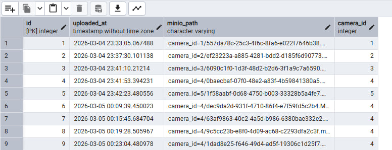 | 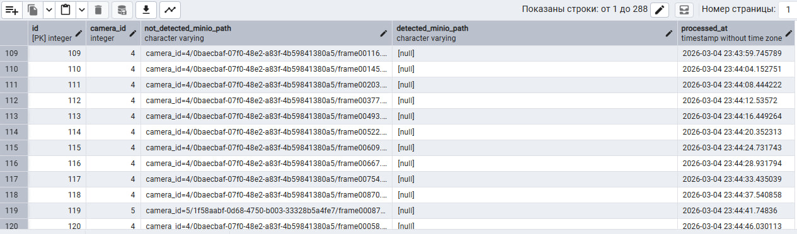 |
| 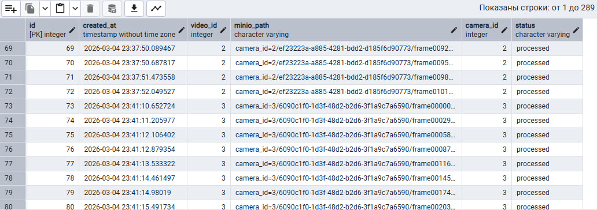 | 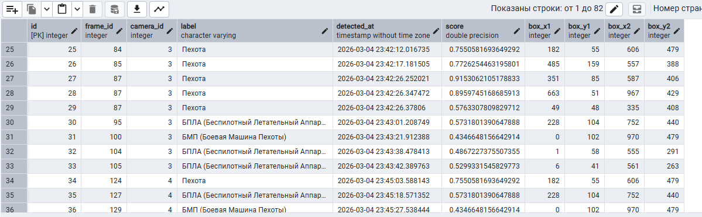 |

### 🪣 Структура MinIO

| | | |
|-|-|-|
| 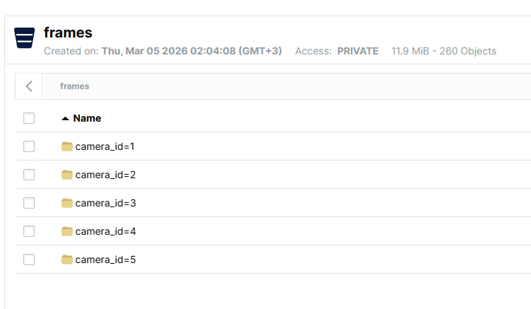 | 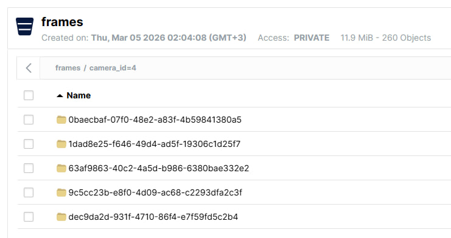 | 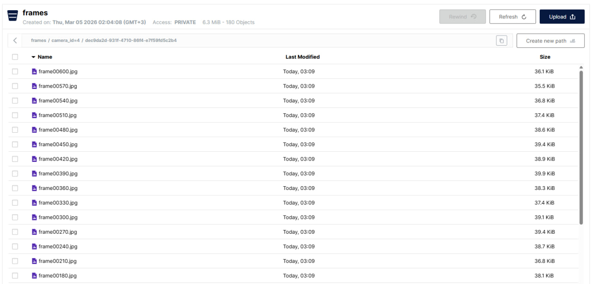 |

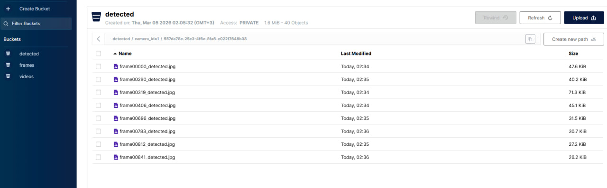

### 🔍 Примеры детекции

| Пехота (3 шт.) | Танк (1 шт.) | Артиллерия (1 шт.) |
|---------------|-------------|-------------------|
| 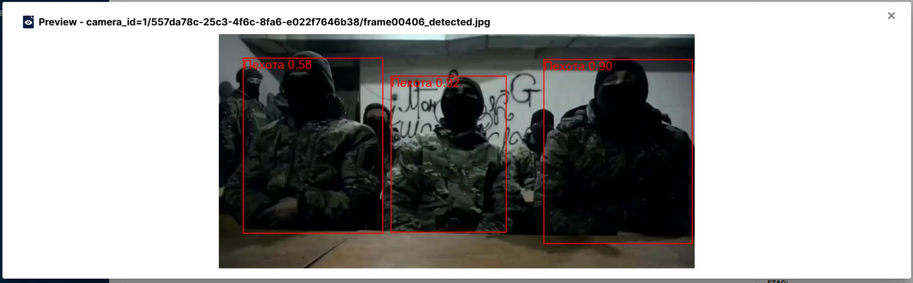 | 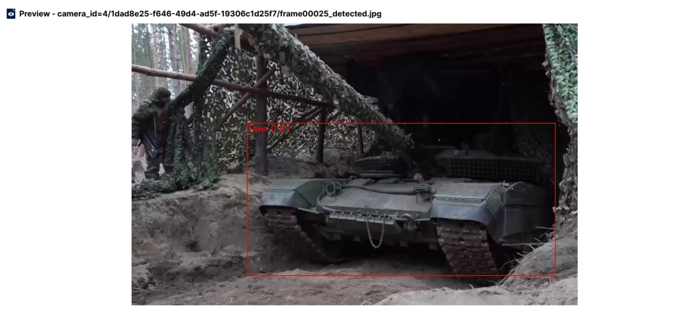 | 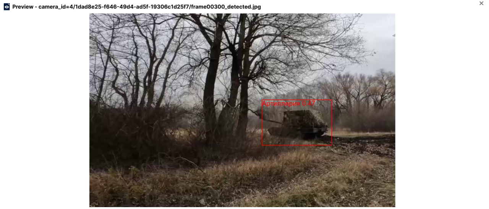 |


